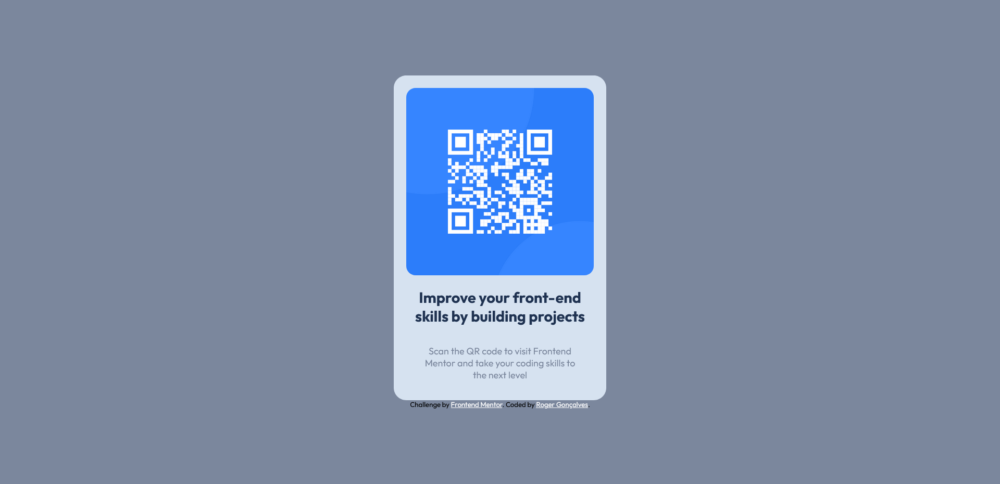

# Frontend Mentor - QR code component solution

This is a solution to the [QR code component challenge on Frontend Mentor](https://www.frontendmentor.io/challenges/qr-code-component-iux_sIO_H). Frontend Mentor challenges help you improve your coding skills by building realistic projects. 

## Table of contents

- [Overview](#overview)
  - [Screenshot](#screenshot)
  - [Links](#links)
  - [Built with](#built-with)
- [Author](#author)

## Overview

### Screenshot

### Links

- Solution URL: [https://www.frontendmentor.io/solutions/responsive-qr-code-main-page-KkEaML0tKq](https://www.frontendmentor.io/solutions/responsive-qr-code-main-page-KkEaML0tKq)
- Live Site URL: [https://gabirueitz.github.io/qr-code-component-main/](https://gabirueitz.github.io/qr-code-component-main/)

### Built with

- Semantic HTML5 markup
- CSS custom properties

## Author

- GitHub - [@gabirueitz](https://github.com/gabirueitz)
- Frontend Mentor - [@gabirueitz](https://www.frontendmentor.io/profile/gabirueitz)
- Twitter - [@gabirueitz](https://www.twitter.com/gabirueitz)